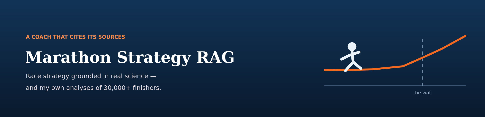
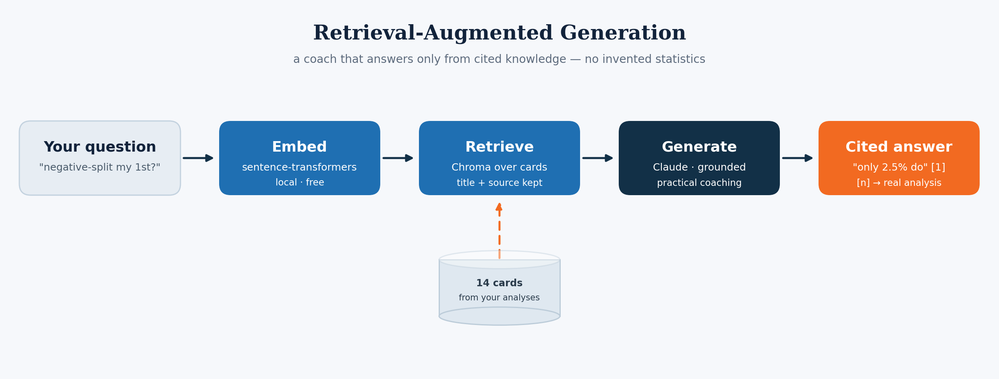
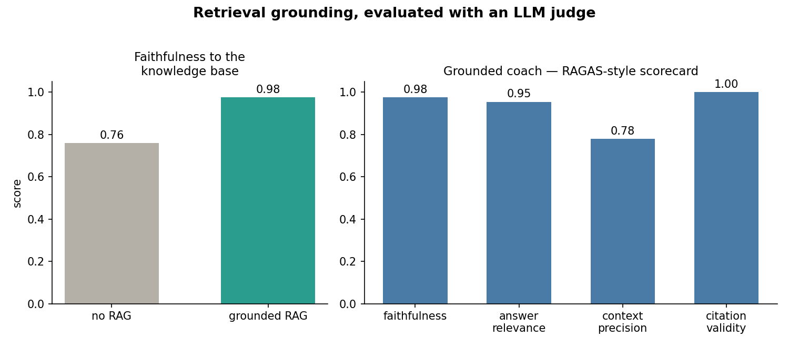

<p align="center">
  
</p>

# Marathon Strategy RAG

A retrieval-augmented **marathon coach**. Ask a race-strategy question in plain
English — *"should I try to negative-split my first marathon?"*, *"how much
slower will 80°F make me?"* — and get practical, **cited** advice grounded in a
knowledge base built from real marathon science **and my own published data
analyses** of 30,000+ Boston finishers.

> 🌐 **Overview:** https://lyhjeremy.github.io/marathon-strategy-rag/

## Why
Generic running advice is everywhere, and a plain LLM will confidently make up
numbers. This coach only answers from a curated, citable knowledge base — so when
it says *"only 2.5% of runners actually negative-split, so aim for an even split
instead,"* that figure traces back to a real analysis, shown as a `[n]` citation.

Several cards are distilled from my own marathon projects:
- **Negative-Split Myth** — 2.5% of 31,912 Boston finishers ran a true negative split
- **Hitting the Wall** — pace inflects sharply at ~30 km
- **The Heat Tax** — ~1 minute slower per °F of race-day heat
- **Course Difficulty** — Boston & NYC are the hardest Majors
- **Super-Shoes** — ~67 s of the modern elite gain is footwear

…alongside general cards on fueling, tapering, carb-loading, hydration, pacing
and hills.

## How it works

<p align="center">
  
</p>

Retrieval is fully local and free (`sentence-transformers` + Chroma). Generation
runs on the **Claude CLI** by default (your Claude subscription, no per-token
cost); set `ANTHROPIC_API_KEY` to use the API instead.

## Evaluated with an LLM judge
Grounding is only worth it if it makes answers more trustworthy — so `src/eval.py`
measures that, RAGAS-style, with an LLM as the judge over a gold question set:

<p align="center">
  
</p>

| metric | score |
|---|---|
| faithfulness — **grounded coach** | **0.98** |
| faithfulness — bare LLM, no retrieval | 0.76 |
| answer relevance | 0.95 |
| context precision | 0.78 |
| citation validity | 1.00 |

A bare LLM's claims align with the vetted knowledge base only ~76% of the time;
grounding the *same* model in retrieved passages lifts that to **0.98**, with every
`[n]` citation pointing at a real retrieved source. That gap is the whole reason to
do RAG, quantified. Reproduce with `python -m src.eval`.

## Quick start
```bash
pip install -r requirements.txt

python -m src.ingest                 # index the bundled knowledge base

python -m src.cli ask "how should I pace the last 10K to avoid hitting the wall?"
python -m src.cli chat               # interactive coach

python -m src.cli ask "..." --engine lc   # same chain, built with LangChain LCEL
python -m src.eval                        # score faithfulness with an LLM judge
```
The knowledge base ships **with the repo** (`knowledge/*.md`) — no downloads.

## Two engines: hand-rolled and LangChain
The default `native` engine wires retrieval → prompt → LLM by hand (`coach.py`).
Pass `--engine lc` to run the **identical** flow as a LangChain **LCEL** pipeline
(`chain_lc.py`) — `{context: retrieve|format, query: passthrough} | prompt | llm`
— demonstrating the framework most production RAG is built on, with the same
grounded, cited output.

## Files
| Path | What it is |
|---|---|
| `knowledge/*.md` | The knowledge base — one citable card per topic |
| `src/ingest.py` | Parse cards → chunk → local embeddings → Chroma index |
| `src/embedder.py` | Local sentence-transformers embedder (free, offline) |
| `src/retriever.py` | Semantic search over the knowledge chunks |
| `src/coach.py` | The RAG chain (hand-rolled): retrieve → grounded, cited answer |
| `src/chain_lc.py` | The same chain built with **LangChain LCEL** (`--engine lc`) |
| `src/eval.py` | LLM-judge evaluation: faithfulness / relevance / citation validity |
| `src/llm.py` | LLM wrapper — Claude CLI (default) or Anthropic API |
| `src/cli.py` | `ask` (one-shot) and `chat` (interactive) commands |

## Extending it
Drop a new `knowledge/<topic>.md` card (with a `# Title` and a `> Source:` line),
re-run `python -m src.ingest`, and the coach can cite it immediately.

## License
[MIT](LICENSE) © 2026 Jeremy Lee
